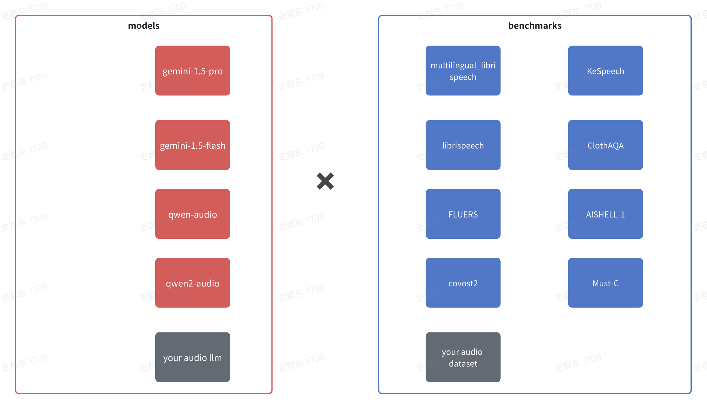

# OVERVIEW

AudioEvals is an open-source framework designed for the evaluation of large audio models (Audio LLMs).
With this tool, you can easily evaluate any Audio LLM in one go.

Not only do we offer a ready-to-use solution that includes a collection of 
audio benchmarks and evaluation methodologies, but we also provide the capability for 
you to customize your evaluations.


# Quick Start

## ready env
```shell
git clone https://github.com//AduioEval.git
cd AduioEval
conda create -n aduioeval python=3.10 -y
conda activate aduioeval
pip install -r requirements.txt
```

## run
```bash

pip install -e .

# eval gemini model only when you are in USA
export GOOGLE_API_KEY = $your-key
python audio_evals/main.py --dataset clotho-aqa-local --model gemini-pro

# eval qwen-audio api model
export DASHSCOPE_API_KEY = $your-key
python audio_evals/main.py --dataset clotho-aqa-local --model qwen-audio

# eval qwen2-audio  offline model in local
pip install -r requirments-offline-model.txt
python audio_evals/main.py --dataset clotho-aqa-local --model qwen2-audio
```

## res

after program executed, you will get the performance in console and detail result as below:

```txt
- res
    |-- $time-$name-$dataset.jsonl
```


# Usage



To run the evaluation script, use the following command:

```bash
python audio_evals/main.py --dataset <dataset_name> --model <model_name>
```

Dataset Options
The `--dataset` parameter allows you to specify which dataset to use for evaluation. The following options are available:

- `clotho-aqa-local`: 
- `KeSpeech-hf`:
- `librispeech-test-clean`: 
- `librispeech-dev-clean`: 
- `librispeech-test-other`: 
- `librispeech-dev-other`: 
- `mls_dutch`: 
- `mls_french`: 
- `mls_german`:
- `mls_italian`:
- `mls_polish`:
- `mls_portuguese`:
- `mls_spanish`:
- `fleurs-zh`: 
- `covost2-en-zh`:
- `covost2-en-ar`:
- `WenetSpeech-test-meeting`:
- `WenetSpeech-test-net`:

eval your dataset: [docs/how add a dataset.md](docs%2Fhow%20add%20a%20dataset.md)

## dataset detail
| <dataset_name> | name                     | domain                            | metric |
|----------------|--------------------------|-----------------------------------|--------|
| clotho-aqa     | ClothoAQA                | QAQ(AudioQA)                      | acc    |
| KeSpeech-*     | multilingual_librispeech | ASR(Automatic Speech Recognition) | wer    |
| librispeech-*  | librispeech              | ASR                               | wer    |
| fleurs-*       | FLEURS                   | ASR                               | wer    |
|                | AISHELL-1                | ASR                               | wer    |
| WenetSpeech-*  | WenetSpeech              | ASR                               | wer    |
| covost2-*      | covost2                  | STT(Speech Text Translation)      | BLEU   |


### Model Options

The `--model` parameter allows you to specify which model to use for evaluation. The following options are available:

- `qwen2-audio`: Use the Qwen2 Audio model.
- `gemini-1.5-pro`: Use the Gemini 1.5 Pro model.
- `gemini-1.5-flash`: Use the Gemini 1.5 Flash model.
- `qwen2-audio-api`: Use the Qwen2 Audio API model.

eval your model: [docs/how eval your model.md](docs%2Fhow%20eval%20your%20model.md)

# Contact us
If you have questions, suggestions, or feature requests regarding AudioEvals, please submit GitHub Issues to jointly build an open and transparent UltraEval evaluation community.


# Citation

