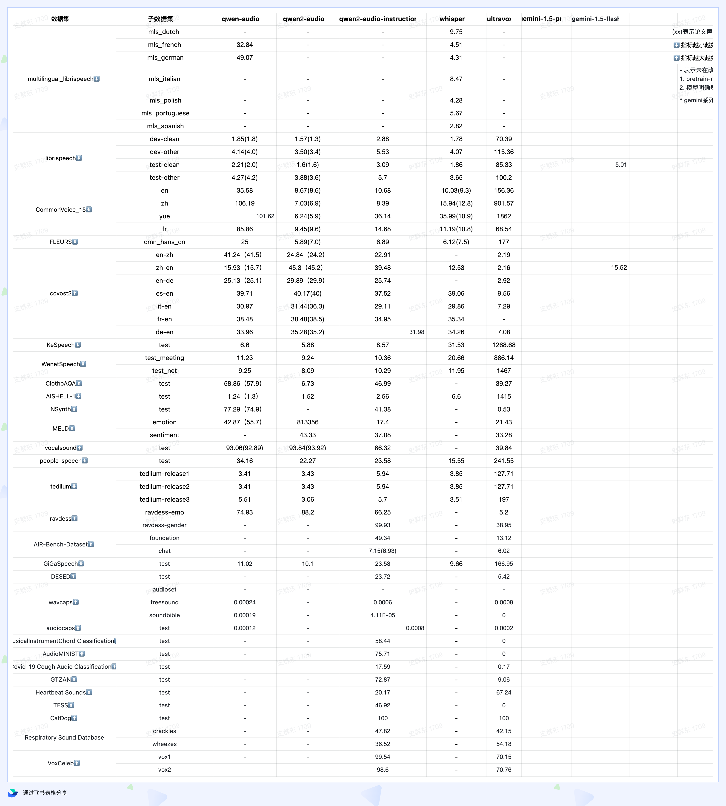

# leaderboard
> **Foundation Modal**: Audio + Limited Text (Optional) → Text
> - This modal primarily focuses on traditional audio tasks such as Automatic Speech Recognition (ASR) and Text-to-Speech (TTS).
>
> **Chat Modal**: Audio + Text → Text
> - This modal is designed for interactive applications like chatbots and voice assistants. It includes tasks such as Audio Question Answering, Music Question Answering, Medicine Classification and emotional recognition.

<table>
<tr>
<td></td>
<td></td>
</tr>
</table>

# support datasets


# News/Updates:

2024/10/8 🎉 we support 30+ datasets!

2024/9/7 🎉 we support `vocalsound`, `MELD` benchmark!

2024/9/6 🎉 we support `Qwen/Qwen2-Audio-7B`, `Qwen/Qwen2-Audio-7B-Instruct` models!

# OVERVIEW

AudioEvals is an open-source framework designed for the evaluation of large audio models (Audio LLMs).
With this tool, you can easily evaluate any Audio LLM in one go.

Not only do we offer a ready-to-use solution that includes a collection of
audio benchmarks and evaluation methodologies, but we also provide the capability for
you to customize your evaluations.


# Quick Start

## ready env
```shell
git clone https://github.com//AduioEval.git
cd AduioEval
conda create -n aduioeval python=3.10 -y
conda activate aduioeval
pip install -r requirements.txt
```

## run
```bash
export PYTHONPATH=$PWD:$PYTHONPATH
mkdir log/
# eval gemini model only when you are in USA
export GOOGLE_API_KEY=$your-key
python audio_evals/main.py --dataset KeSpeech-sample --model gemini-pro

# eval qwen-audio api model
export DASHSCOPE_API_KEY=$your-key
python audio_evals/main.py --dataset KeSpeech-sample --model qwen-audio

# eval qwen2-audio  offline model in local
pip install -r requirments-offline-model.txt
python audio_evals/main.py --dataset KeSpeech-sample --model qwen2-audio-offline
```

## res

after program executed, you will get the performance in console and detail result as below:

```txt
- res
    |-- $time-$name-$dataset.jsonl
```

# performance




> () is offical performance


# Usage


To run the evaluation script, use the following command:

```bash
python audio_evals/main.py --dataset <dataset_name> --model <model_name>
```

## Dataset Options

The `--dataset` parameter allows you to specify which dataset to use for evaluation. The following options are available:

- `tedlium-release1`
- `tedlium-release2`
- `tedlium-release3`
- `catdog`
- `audiocaps`
- `covost2-en-ar`
- `covost2-en-ca`
- `covost2-en-cy`
- `covost2-en-de`
- `covost2-en-et`
- `covost2-en-fa`
- `covost2-en-id`
- `covost2-en-ja`
- `covost2-en-lv`
- `covost2-en-mn`
- `covost2-en-sl`
- `covost2-en-sv`
- `covost2-en-ta`
- `covost2-en-tr`
- `covost2-en-zh`
- `covost2-zh-en`
- `covost2-it-en`
- `covost2-fr-en`
- `covost2-es-en`
- `covost2-de-en`
- `GTZAN`
- `TESS`
- `nsynth`
- `meld-emo`
- `meld-sentiment`
- `clotho-aqa`
- `ravdess-emo`
- `ravdess-gender`
- `COVID-recognizer`
- `respiratory-crackles`
- `respiratory-wheezes`
- `KeSpeech`
- `audio-MNIST`
- `librispeech-test-clean`
- `librispeech-dev-clean`
- `librispeech-test-other`
- `librispeech-dev-other`
- `mls_dutch`
- `mls_french`
- `mls_german`
- `mls_italian`
- `mls_polish`
- `mls_portuguese`
- `mls_spanish`
- `heartbeat_sound`
- `vocalsound`
- `fleurs-zh`
- `voxceleb1`
- `voxceleb2`
- `chord-recognition`
- `wavcaps-audioset`
- `wavcaps-freesound`
- `wavcaps-soundbible`
- `air-foundation`
- `air-chat`
- `desed`
- `peoples-speech`
- `WenetSpeech-test-meeting`
- `WenetSpeech-test-net`
- `gigaspeech`
- `aishell-1`
- `cv-15-en`
- `cv-15-zh`
- `cv-15-fr`
- `cv-15-yue`


### support dataset detail
| <dataset_name>    | name                     | task                              | domain             | metric     |
|-------------------|--------------------------|-----------------------------------|--------------------|------------|
| tedlium-*         | tedlium                  | ASR(Automatic Speech Recognition) | speech             | wer        |
| clotho-aqa        | ClothoAQA                | AQA(AudioQA)                      | sound              | acc        |
| catdog            | catdog                   | AQA                               | sound              | acc        |
| mls-*             | multilingual_librispeech | ASR                               | speech             | wer        |
| KeSpeech          | KeSpeech                 | ASR                               | speech             | cer        |
| librispeech-*     | librispeech              | ASR                               | speech             | wer        |
| fleurs-*          | FLEURS                   | ASR                               | speech             | wer        |
| aisheel1          | AISHELL-1                | ASR                               | speech             | wer        |
| WenetSpeech-*     | WenetSpeech              | ASR                               | speech             | wer        |
| covost2-*         | covost2                  | STT(Speech Text Translation)      | speech             | BLEU       |
| GTZAN             | GTZAN                    | MQA(MusicQA)                      | music              | acc        |
| TESS              | TESS                     | EMO(emotional recognition)        | speech             | acc        |
| nsynth            | nsynth                   | MQA                               | music              | acc        |
| meld-emo          | meld                     | EMO                               | speech             | acc        |
| meld-sentiment    | meld                     | SEN(sentiment recognition)        | speech             | acc        |
| ravdess-emo       | ravdess                  | EMO                               | speech             | acc        |
| ravdess-gender    | ravdess                  | GEND(gender recognition)          | speech             | acc        |
| COVID-recognizer  | COVID                    | MedicineCls                       | medicine           | acc        |
| respiratory-*     | respiratory              | MedicineCls                       | medicine           | acc        |
| audio-MNIST       | audio-MNIST              | AQA                               | speech             | acc        |
| heartbeat_sound   | heartbeat                | MedicineCls                       | medicine           | acc        |
| vocalsound        | vocalsound               | MedicineCls                       | medicine           | acc        |
| voxceleb*         | voxceleb                 | GEND                              | speech             | acc        |
| chord-recognition | chord                    | MQA                               | music              | acc        |
| wavcaps-*         | wavcaps                  | AC(AudioCaption)                  | sound              | acc        |
| air-foundation    | AIR-BENCH                | AC,GEND,MQA,EMO                   | sound,music,speech | acc        |
| air-chat          | AIR-BENCH                | AC,GEND,MQA,EMO                   | sound,music,speech | GPT4-score |
| desed             | desed                    | AQA                               | sound              | acc        |
| peoples-speech    | peoples-speech           | ASR                               | speech             | wer        |
| gigaspeech        | gigaspeech               | ASR                               | speech             | wer        |
| cv-15-*           | common voice 15          | ASR                               | speech             | wer        |

eval your dataset: [docs/how add a dataset.md](docs%2Fhow%20add%20a%20dataset.md)


### Model Options

The `--model` parameter allows you to specify which model to use for evaluation. The following options are available:

- `qwen2-audio`: Use the Qwen2 Audio model.
- `gemini-pro`: Use the Gemini 1.5 Pro model.
- `gemini-1.5-flash`: Use the Gemini 1.5 Flash model.
- `qwen-audio`: Use the qwen2-audio-instruct Audio API model.

eval your model: [docs/how eval your model.md](docs%2Fhow%20eval%20your%20model.md)

# Contact us
If you have questions, suggestions, or feature requests regarding AudioEvals, please submit GitHub Issues to jointly build an open and transparent UltraEval evaluation community.


# Citation
