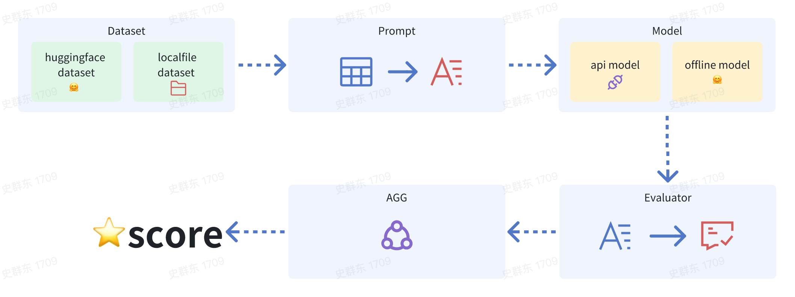

In the Quick Start section, you can initiate an evaluation task within just a few seconds. However, delving deeper into the process, here's a more detailed breakdown of what's involved when you actually launch an evaluation task:



When initiating an evaluation task, you will need to provide the following components:
- **Dataset**: This is the data set against which the model's performance will be evaluated. It should be representative of the real-world scenarios the model is expected to handle. Build-in Config Path:  [dataset](../registry/dataset)
- **Prompt**: The prompt serves as a converter, translating data directives into model inputs.
 We have standardized the prompt format to facilitate prompt management, ensuring that users need not be concerned with the intricacies of the underlying model's input style. Build-in Config Path: [prompt](../registry/prompt)
- **Model**: The model to be evaluated. Build-in Config Path: [model](../registry/model)
- **Post-Process**: This step involves any necessary processing or transformations applied to the model's output before evaluation. This could include formatting, filtering, or normalization. Build-in Config Path: [post-process](../registry/process)
- **Evaluator**: The evaluator serves as the mechanism for scoring each piece of data, simplifying the identification of problematic cases. Build-in Config Path: [evaluator](../registry/evaluator)
- **Aggregation**:Distinct from the Evaluator in scope, this component operates at the dataset level. It aggregates the results of the evaluation across all data points, providing a comprehensive view of the model's performance. Build-in Config Path: [agg](../registry/agg)


When evaluating a chat model, you only need to provide the dataset and the chat model.
You do not need to worry about details such as prompt, post-process,
evaluator, etc. You can refer to the default task configuration in [eval_task/](../registry/eval_task).

Example Configuration:
```yaml
asr:
  class: audio_evals.base.EvalTaskCfg
  args:
    dataset: KeSpeech
    prompt: asr
    model: qwen-audio
    post_process: ['json_content']
    evaluator: wer
    agg: wer-practice
```

If you wish to replace some configuration, you can use `--$config_name` in the evaluation command line.

Here is an example of how to launch an evaluation task for a pretrained model, which is significantly different from a chat model.
# how eval a pretrain model

A pretrain model need custom prompt to feed, and the prompt need to be pre-defined in the registry.
An output of the pretrain model also need special post process.

## eavl qwen2-audio pretrain model

### registry
1. registry model at [offline.yaml](../registry/model/offline.yaml)
```yaml
qwen2-audio-offline:
  class: audio_evals.models.qwen.Qwen2audioPretrain
  args:
    path: Qwen/Qwen2-Audio-7B
    sample_params:
      do_sample: false
      max_new_tokens: 256
      min_new_tokens: 1
      length_penalty: 1.0
      num_return_sequences: 1
      repetition_penalty: 1.0
      use_cache: True
```
2. registry prompt at [qwen2-audio-pretrain.yaml](../registry/prompt/qwen2-audio-pretrain.yaml)

```yaml
qwen2-audio-pretrain-asr-zh:
  class: audio_evals.prompt.base.Prompt
  args:
    template: '<|audio_bos|><|{{WavPath}}|><|audio_eos|>Detect the language and recognize the speech: <|zh|>'

```

3. registry post process at [base.yaml](../registry/process/base.yaml)

```yaml
qwen_pretrain_asr_tractor_zh:
  class: audio_evals.process.qwen.QwenAudioASRExtract
  args:
    lang: zh
```

### launch
```shell
python audio_evals/main.py --dataset local-fleurs-zh --model qwen2-audio-offline --prompt qwen2-audio-pretrain-asr-zh --post_process qwen_pretrain_asr_tractor_zh
```
